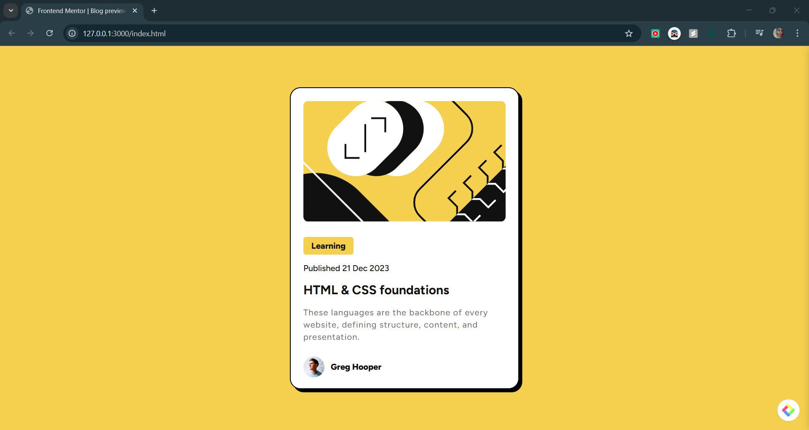

# Frontend Mentor - Blog Preview Card Solution

This is a solution to the [Blog Preview Card challenge on Frontend Mentor](https://www.frontendmentor.io/challenges/blog-preview-card-ckPaj01IcS). Frontend Mentor challenges help you improve your coding skills by building realistic projects.

## Overview

### The Challenge

Users should be able to:

- View the optimal layout of the blog preview card depending on the device's screen size.
- See hover and focus states for interactive elements.

### Screenshot




### Links

- [Live Site URL](https://pavanimankonda.github.io/Blog-Preview-Card/)

## My Process

### Built With

- Semantic HTML5 markup
- CSS custom properties
- Flexbox
- CSS Grid
- Mobile-first workflow

### What I Learned

During this project, I reinforced my knowledge of CSS flexbox and grid. I also explored hover states and animations to enhance user experience.

#### Example Code:

```css
.container {
    width: 384px;
    height: 522px;
    background-color: hsl(0, 0%, 100%);
    border-radius: 20px;
    border: 2px solid black;
    padding: 24px;
    box-shadow: 6px 6px 0px black;
    transition: box-shadow 0.3s ease;
}
```

### Useful Resources

- MDN Web Docs—comprehensive documentation on HTML, CSS, and JavaScript.
- [CSS Tricks](https://css-tricks.com/) - Great for learning advanced CSS techniques.

## Author

- Frontend Mentor - [@pavanimankonda](https://www.frontendmentor.io/profile/pavanimankonda)

## Acknowledgments

A big thanks to the Frontend Mentor community for providing valuable challenges and resources!

